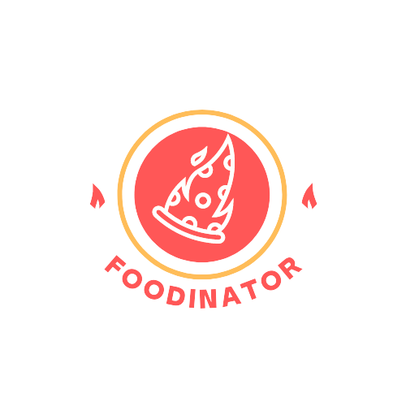

## Foodinator, for food lovers
 

[Foodinator](https://foodinator.netlify.app/) is a recipe application that is powered by the spoonacular API.  
Recipes from all over the world, you can search for recipes using several filters, or via the search bar. You will find for each, an illustration, ingredients and instructions.
A carousel of the most popular recipes is updated automatically.

 

## 🚀 &nbsp;Project features

  - Search filters by some tags
  - Search bar
  - Recipe carousel updated via API
  - Some animations fade in-out recipes (framer-motion)
  
  

 ## 🔧 &nbsp;Frameworks and tools
 

 
        
        
        
        
        

 

This was my first experience with styled components and I loved it,
go visit : [Foodinator](https://foodinator.netlify.app/)

  

# Preview

